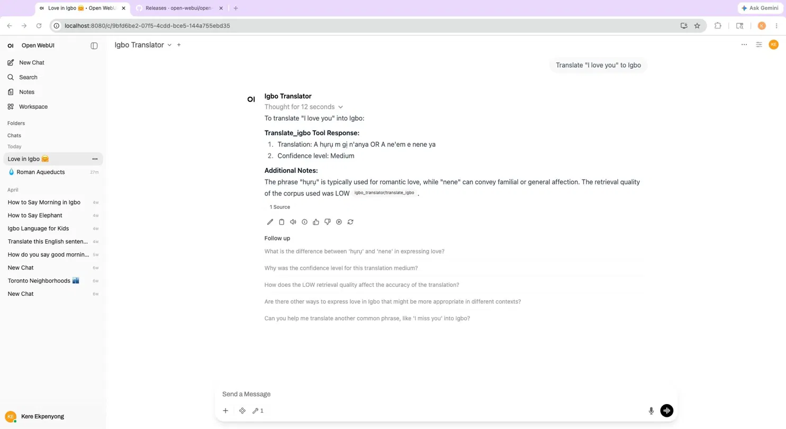

# Igbo-English RAG Translator


A production RAG translation system for Igbo ↔ English, running entirely on local infrastructure — Qwen2.5:7B via Ollama, a FAISS vector index of 1M curated translation pairs, a FastAPI REST API, a live feedback/correction system, and a RAGAS evaluation suite. Zero API costs, zero data leaving the machine.

## Why I built this

Igbo is a low-resource African language. Despite being spoken by tens of millions of people, it is badly underserved by mainstream translation systems — training data is scarce, noisy, and rarely curated, and commercial models treat it as an afterthought.

This project is personal. I was raised in Igbo land and grew up speaking the language fluently. Igbo is part of who I am, and I want to keep that connection alive — with a tool that produces *formal, correct* Igbo rather than transliterated approximations or social media noise.

Growing up speaking the language also means I can directly evaluate whether the system's output is correct — an advantage most NLP researchers working on low-resource African languages don't have. When the model returns "M m i love ya" instead of "A hụrụ m gị n'anya", I know immediately it's wrong, and I can trace exactly where the pipeline failed.

## Demo

Integrated with Open WebUI as a dedicated model with tool calling. The system routes each query through the RAG pipeline, returns citations, and surfaces retrieval quality directly in the chat UI.



## Architecture

The full RAG pipeline, end to end:

1. **Query** — an Igbo or English phrase, with an optional `direction` (`igbo_to_en` / `en_to_igbo`).
2. **Correction lookup** — before hitting the RAG pipeline, the system checks `corrections.jsonl` for an exact match. If found, returns the verified translation instantly with zero latency.
3. **Embedding** — the query is embedded with `nomic-embed-text` (768-dim vectors) served by Ollama (~83ms).
4. **Retrieval** — FAISS performs cosine similarity search over **1M curated translation pairs** (~3ms). The pipeline over-fetches (8× the target count) and filters by direction and quality threshold.
5. **Quality assessment** — the best retrieval distance is bucketed into a quality tier:
   - `HIGH`   — distance `< 0.08` (strong semantic match, corpus is trustworthy)
   - `MEDIUM` — distance `< 0.10` (reasonable match, use with caution)
   - `LOW`    — distance `>= 0.10` (weak match, prefer model knowledge)
   - `correction` — exact match found in feedback store (highest priority)
6. **Quality-aware prompt routing** — the assessed quality selects one of two prompts:
   - **Grounded prompt** (`HIGH` / `MEDIUM`): stays close to the retrieved corpus examples.
   - **Fallback prompt** (`LOW` / `no_matches`): explicitly instructs the model to *ignore* weak matches and rely on its own knowledge of formal Igbo, backed by a curated reference phrase list.
7. **Generation** — `Qwen2.5:7B` runs locally via Ollama (temperature 0.1) and produces the translation plus confidence and usage notes.
8. **Response** — FastAPI returns the translation along with `retrieval_quality` and the retrieved `citations` (input/output/direction/distance), plus measured latency.

```
query
  → correction lookup (corrections.jsonl — instant if match found)
  → nomic-embed-text (768-dim, ~83ms)
  → FAISS cosine search (1M pairs, ~3ms)
  → distance-based quality assessment (HIGH < 0.08, MEDIUM < 0.10, LOW >= 0.10)
  → quality-aware prompt routing (grounded vs fallback)
  → Qwen2.5:7B (Ollama)
  → FastAPI response { translation, retrieval_quality, citations, latency_ms }
```

## Key engineering decisions

### 1. FAISS over ChromaDB — a performance migration

The system was originally built on ChromaDB with a 9.7M-pair SQLite store. Under load, ChromaDB retrieval took **60–90 seconds per query** due to SQLite scan overhead at that scale — the actual query was sub-millisecond but thread pool contention and index loading blocked the FastAPI event loop.

The fix was to migrate to FAISS with a curated index extracted from the original 19.5M-pair NLLB dataset:
- Extract and quality-filter 1M pairs from `nllb_train.jsonl`
- Embed with `nomic-embed-text` (~5 hours one-time cost)
- Build a normalised `IndexFlatIP` FAISS index (cosine similarity)
- Result: **~86ms total retrieval** (83ms embed + 3ms search) vs 60–90s with ChromaDB

### 2. Live feedback and correction system

The system includes a human-in-the-loop correction layer built for use by a native Igbo speaker. When a translation is wrong, a correction can be submitted directly from the Open WebUI chat using the `correct_translation` tool:

```
Correct: "I miss you" in en_to_igbo should be "A chefuo m gị"
```

Corrections are:
- Saved to `data/corrections.jsonl` (persists across restarts)
- Loaded into memory immediately — no restart needed
- Checked before the RAG pipeline on every subsequent query
- Returned with `retrieval_quality: "correction"` to signal they are verified

This is a practical implementation of human-in-the-loop RLHF for a low-resource language where a native speaker's judgement is the ground truth.

### 3. Quality-aware prompt routing

The naive RAG approach feeds whatever the retriever returns straight into the prompt and optimises for faithfulness to that context. That is the **wrong objective when corpus quality is variable.** The NLLB dataset contains noise — transliterated English, internet slang, and mislabeled pairs. Blindly grounding on a weak match produces a confidently wrong translation.

Routing on retrieval distance lets the system decide *whether the corpus deserves trust* for a given query. When the match is strong, it grounds tightly. When the match is weak, it deliberately overrides the corpus and falls back to the model's own knowledge of formal Igbo, backed by a curated reference phrase list validated by a native speaker.

### 4. Native speaker validation

Most NLP projects on low-resource languages are built without a native speaker in the loop. Having grown up speaking Igbo fluently, I can directly evaluate output correctness and trace pipeline failures — "M m i love ya" vs "A hụrụ m gị n'anya" is immediately recognisable as wrong. The fallback prompt's reference phrase list was hand-curated and verified, not generated.

### 5. Local LLM over a hosted API

- **Zero cost** — 1M pairs and an iterative eval loop would be expensive against a metered API. Local inference is free to run as often as needed.
- **Data privacy** — Igbo text, including anything personal or culturally sensitive, never leaves the machine.
- **Reproducibility** — a pinned local model + a pinned local vector store means evals are deterministic and not subject to a vendor silently changing the model underneath.

### 6. Corpus curation strategy

The raw NLLB dataset has 19.5M pairs but significant noise. The quality filter for the FAISS index:
- Keeps only `Translate` instruction pairs (drops QA, summarisation etc.)
- Filters pairs with outputs under 4 characters
- Removes social media noise (`mmmmm`, `ya nice`, `lol` etc.)
- For `en_to_igbo` only: drops pairs where the Igbo output contains no unicode characters (genuine Igbo always uses diacritics)
- Result: ~87% of sampled pairs pass the filter

## RAGAS evaluation results

Evaluated with RAGAS (faithfulness, answer relevancy, context precision), judged by DeepSeek-r1:14b with `nomic-embed-text` embeddings. Evals were run against the original ChromaDB store.

| Query | Direction | Retrieval | Faithfulness | Answer Relevancy | Context Precision |
|-------|-----------|-----------|--------------|------------------|-------------------|
| Ụtụtụ ọma | igbo→en | HIGH | 0.833 | 0.875 | 1.000 |
| A hụrụ m gị n'anya | igbo→en | HIGH | 0.250 | 0.733 | 1.000 |
| Kedu ka i mere? | igbo→en | HIGH | 0.500 | 0.745 | 0.000 |
| Biko nọdụ ala | igbo→en | HIGH | 0.750 | 0.851 | 0.950 |
| I love you | en→igbo | LOW | 0.250 | 0.809 | 0.000 |
| Good morning | en→igbo | MEDIUM | 0.000 | 0.919 | 0.000 |
| Thank you | en→igbo | LOW | 0.000 | 0.908 | 0.000 |
| Please sit down | en→igbo | MEDIUM | 0.800 | 0.824 | 0.804 |
| **AVERAGE** | | | **0.423** | **0.833** | **0.469** |

### Why LOW retrieval queries score low on faithfulness — by design

The low faithfulness numbers on `LOW`/`MEDIUM` retrieval rows are **expected and correct.** For those queries the corpus matches are noisy, so the fallback prompt deliberately instructs the model to override the retrieved citations and translate from its own knowledge of formal Igbo. RAGAS measures faithfulness as *consistency between the response and the retrieved context* — so when the system correctly ignores bad context, RAGAS penalises it as "unfaithful."

In other words, a low faithfulness score here is a signal that the routing layer is doing its job: the response is faithful to *correct Igbo*, not to a noisy corpus. Answer relevancy stays high (0.833 average) across exactly these rows, which is the metric that actually reflects translation quality in this regime.

## Stack

| Component | Technology |
|---|---|
| Vector index | FAISS IndexFlatIP (1M curated pairs, 768-dim) |
| Source corpus | NLLB dataset (19.5M pairs, `nllb_train.jsonl`) |
| Embeddings | nomic-embed-text (768-dim, via Ollama) |
| LLM | Qwen2.5:7B (via Ollama) |
| API | FastAPI |
| Feedback system | JSONL corrections store with live reload |
| Evaluation | RAGAS |
| UI integration | Open WebUI (translate + correct tools, dedicated model) |
| Runtime | Python 3.14, fully local |

## Open WebUI integration

The API is integrated into Open WebUI as two callable tools and a dedicated **Igbo Translator** model:

- **`translate_igbo`** — translates any phrase via the RAG pipeline
- **`correct_translation`** — submits a correction that takes effect immediately

To enable:
1. Start the API: `python src/run.py`
2. In Open WebUI → **Tools** → create a new tool using the code in `src/owui_tool.py`
3. In **Workspace → Models** → create a model named `Igbo Translator` with base model `Qwen2.5:7B`, the system prompt below, and the Igbo Translator tool enabled

**System prompt for the model:**
```
You are an Igbo-English translation assistant powered by a RAG pipeline
grounded on 1 million curated Igbo-English translation pairs.

BEHAVIOUR:
Every message the user sends is a translation request. Do not ask for
clarification. Translate immediately using the translate_igbo tool.

- If the message looks like English → call translate_igbo with direction='en_to_igbo'
- If the message looks like Igbo (contains ụ, ọ, ị or words like kedu, biko, daalụ)
  → call translate_igbo with direction='igbo_to_en'
- If unsure → call translate_igbo with direction=null

CRITICAL RULES:
- ALWAYS call the translate_igbo tool immediately — never skip it
- NEVER translate from your own memory or knowledge
- Quote the tool's translation EXACTLY as returned
- Never ask the user to rephrase or clarify — just translate what they typed

TO CORRECT A WRONG TRANSLATION:
If the user says a translation is wrong and provides the correct one,
call correct_translation with the query, direction, and correct_translation.
Example trigger: "Correct: 'I miss you' in en_to_igbo should be 'A chefuo m gị'"
```

### How corrections work

When a translation is wrong, type in the chat:
```
Correct: "I miss you" in en_to_igbo should be "A chefuo m gị"
```

The model calls `correct_translation`, which:
1. Saves the correction to `data/corrections.jsonl`
2. Reloads corrections into memory immediately
3. Returns a confirmation with the total correction count

Next time `I miss you` is translated, the correction is returned instantly without hitting the RAG pipeline, with `retrieval_quality: "correction"` to indicate it is a verified translation.

## Setup and run

### Prerequisites

[Ollama](https://ollama.com/) running locally with the required models:

```bash
ollama pull Qwen2.5:7B
ollama pull nomic-embed-text
```

### Install

```bash
python3 -m venv .venv
source .venv/bin/activate
pip install -r requirements.txt
```

### Configure

Create a `.env` file at the repository root:

```env
OLLAMA_BASE_URL=http://localhost:11434
LLM_MODEL=Qwen2.5:7B
EMBED_MODEL=nomic-embed-text
FAISS_INDEX_PATH=/path/to/data/igbo_faiss.index
FAISS_META_PATH=/path/to/data/igbo_metadata.json
CORRECTIONS_PATH=/path/to/data/corrections.jsonl
```

### Build the FAISS index (one-time, ~5 hours for 1M pairs)

Requires the raw `nllb_train.jsonl` dataset. Run overnight with caffeinate to prevent sleep:

```bash
caffeinate -i python scripts/build_faiss_index.py
```

Outputs `data/igbo_faiss.index` (~2.9GB) and `data/igbo_metadata.json` (~193MB). The script checkpoints every 5000 pairs — if interrupted, re-run and it resumes automatically.

### Run the API

```bash
python src/run.py
```

Server starts on `http://0.0.0.0:8000`. Interactive Swagger docs at `http://localhost:8000/docs`.

### Run the evaluation suite

```bash
python src/eval.py
```

Runs the RAG pipeline over the test set, scores with RAGAS, prints a per-query table, and writes full results to `eval_results.json`.

## API reference

### `POST /translate`

Translate a phrase. Returns translation, retrieval quality, citations, and latency.

**Request**
```bash
curl -s -X POST http://localhost:8000/translate \
  -H "Content-Type: application/json" \
  -d '{"query": "Ụtụtụ ọma", "direction": "igbo_to_en"}'
```

**Response**
```json
{
  "query": "Ụtụtụ ọma",
  "direction": "igbo_to_en",
  "translation": "Good morning",
  "retrieval_quality": "high",
  "citations": [{"input": "Ụtụtụ ọma", "output": "Good morning", "direction": "igbo_to_en", "distance": 0.05}],
  "latency_ms": 1843.21
}
```

### `POST /feedback`

Submit a translation correction. Takes effect immediately without a restart.

**Request**
```bash
curl -s -X POST http://localhost:8000/feedback \
  -H "Content-Type: application/json" \
  -d '{
    "query": "I miss you",
    "direction": "en_to_igbo",
    "correct_translation": "A chefuo m gị",
    "wrong_translation": "Agụụ gị na-agụ m"
  }'
```

**Response**
```json
{
  "status": "ok",
  "message": "Correction saved: 'I miss you' = 'A chefuo m gị'",
  "total_corrections": 1
}
```

### `GET /feedback/list`

List all saved corrections.

```bash
curl -s http://localhost:8000/feedback/list
```

### `GET /health`

```bash
curl -s http://localhost:8000/health
```

```json
{
  "status": "ok",
  "model": "Qwen2.5:7B",
  "faiss_index": "/path/to/igbo_faiss.index",
  "total_pairs": 1000000,
  "total_corrections": 5
}
```

### `GET /`

```bash
curl -s http://localhost:8000/
```

```json
{"name": "Igbo-English RAG Translator", "version": "1.0.0", "docs": "/docs"}
```

## What I would add next

- **Reranking layer** — a cross-encoder reranker (e.g. Cohere Rerank) over the top-k FAISS candidates to tighten precision before the quality gate.
- **Streaming responses** — token streaming from Ollama to cut perceived latency.
- **LangSmith tracing** — end-to-end tracing of retrieval, routing, and generation to debug quality regressions and inspect per-stage latency.
- **Hybrid search** — combine FAISS vector search with BM25 keyword search for better precision on exact phrase matches (e.g. proper nouns, fixed expressions).
- **RAGAS re-evaluation** — re-run evals against the 1M FAISS index to measure retrieval quality improvement over the original ChromaDB baseline.
- **Fine-tuning from corrections** — periodically use accumulated corrections to fine-tune the LLM via MLX LoRA on the M4 Pro, permanently improving the model's Igbo knowledge.
- **Dialect tagging** — tag corpus pairs by dialect (Owerri, Onitsha, Enugu) and surface dialect information in the API response.